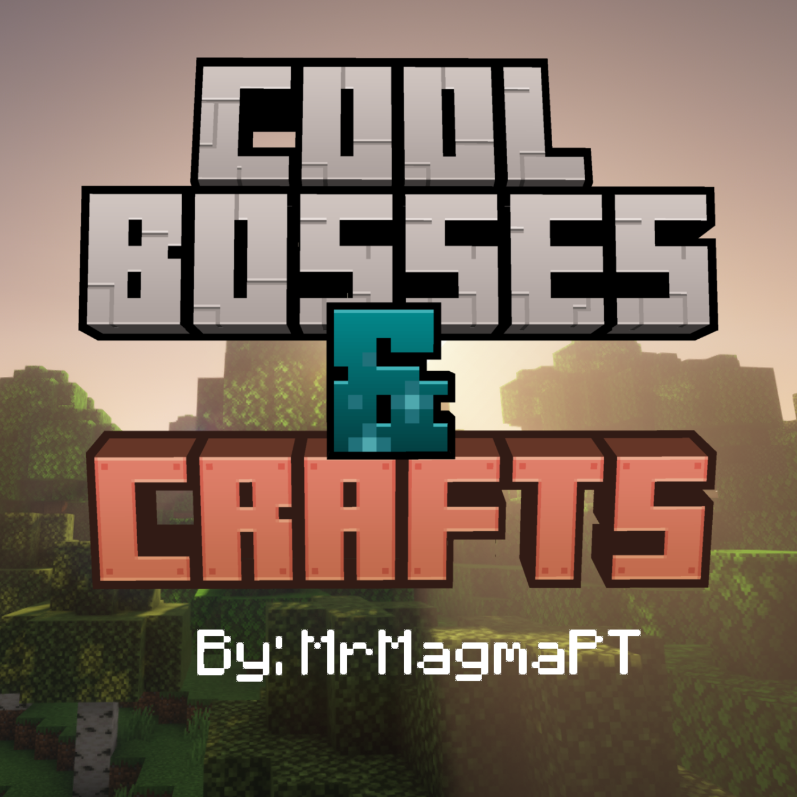

# Cool Bosses & Crafts

[](https://modrinth.com/user/MrMagmaPT) [](https://modrinth.com/datapack/cbc1_datapack)


**Heavily recomended that you download the Resource Pack for the version you are downloading.**
[](https://modrinth.com/resourcepack/cbc1_respack)

 ---
## Introduction

**Cool Bosses & Crafts I**, or `CBC1` for short is a DataPack focused in adding to the base game some new things and changing others, bellow is a list with what is implemented what im working on and what is thought for the future:

 ---
### Content

**Previous v.0.8 Bug Fixed in v.0.9, please update for better experience with the datapack**
> **I found that there is a bug where u do not get the recepies when certain events happen so if you wish to keep using the Data Pack in v.0.8 i recomend the use of this command**
```/recipe give @a *```

1. What's there in the most recent version? (**v.0.9**)
   - 185 new recepies (9 are new food items, 11 New Discs, 9 new enchants,156 quality of life);
   - 9 new food items (craftable);
   - 11 new discs with custom music (the alredy existing ones + 11 new discs);
   - 9 new enchants (1 for the mace, and 8 for swords);
   - 4 new advancement tabs;
   - 30 new advancements (divided in the 4 tabs);

2. **What is currently in the works?**
   + More Advancements to guide and reward the player for getting milestones;
   + New **Tool** type items;
   + New **Weapon** type items;
   + New **Armor** type items;

3. **What is planed for the future versions?**
   + New **bosses**;
   + New **biomes**;
   + New **structures**;
   + More **enchants**;
   + More **food items**;
   + More **music disks**;
 ---
## Versions

There are alot of older version that where created when i was not using Git nor GitHub so from now on all version will be in the version.old folder here:
**version.old:** 
[](./version.old/)
 
---
## Info
This DataPack is heavily inspired in **Vanila Tweaks** (specialy for the quality of life craftings) if you like some of them and want something like this but just some of the quality of life crafts go visit them

**Vanilla Tweaks:** 
[](https://vanillatweaks.net/picker/datapacks/)

There is a **Discord Server** set up where i answer **all questions** and help people in case of **bugs** (its also the best place to **report bugs**), i will also let people know when a new version comes out in there.
**Discord Server:** 
[](https://discord.gg/7pAHmxZX5Y)


I will create a playlist with all the music from the music disks, for now this is the 11th disk "**The End**" 
**YouTube:** 
[](https://youtu.be/H5PbzRFTcWI)